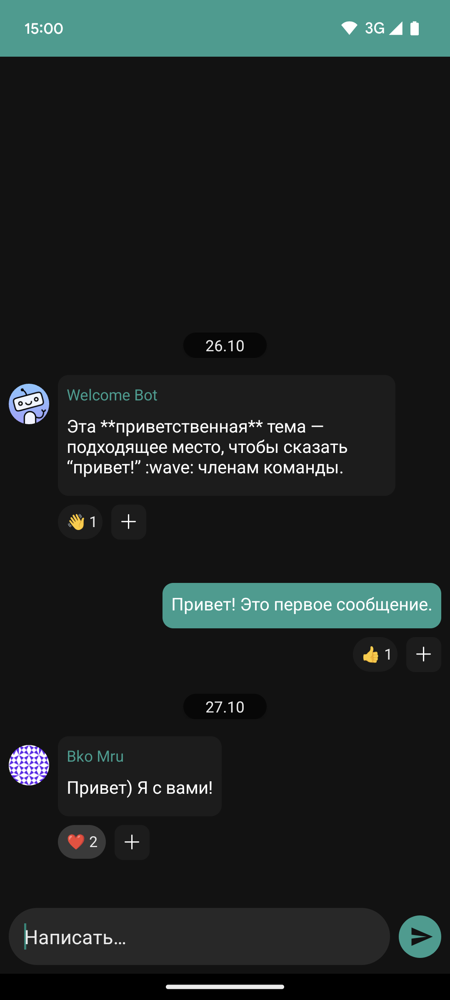

# Zulip Messenger

## Описание
Zulip Messenger - это Android-приложение для обмена сообщениями, разработанное с использованием [Zulip API](https://zulip.com/api/).

## Снимки экрана
 
 

## Используемые технологии
* Язык - **Kotlin**
* Паттерн презентационного слоя - **ELM** на **Elmslie**
* Внедрение зависимостей - **Dagger2**
* Работа с асинхронным и многопоточным кодом - **Coroutines**
* Работа с базами данных - **Room**
* Работа с сетевыми запросами - **Retrofit**
* Сериализация - **Kotlinx.Serialization**
* UI - **View**/**Custom View**
* Навигация - **Cicerone**
* Загрузка изображений - **Coil**